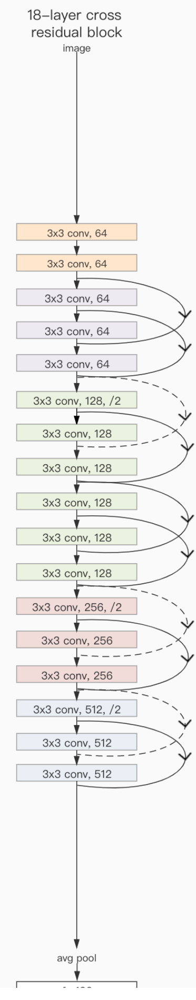
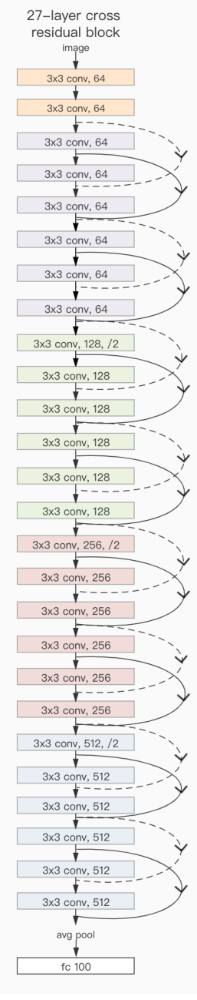
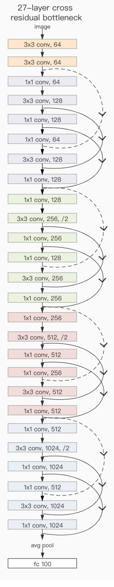
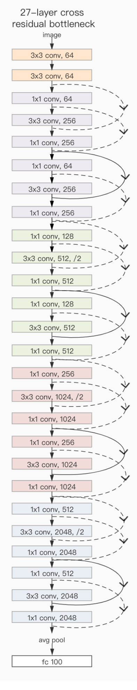

# Cross-Resnet
Cross-Resnet ():

C-ResNet18-A            |  C-ResNet27-A2            |  C-ResNet27-B            |  C-ResNet27-C            |
:-------------------------:|:-------------------------:|:-------------------------:|:-------------------------:
  |   |   |  

## Overview
Here we provide the code of four cross resnet block in pytorch, along with the four datasets for training in paper . The repository is organised as follows:
- `data/` contains two datasets data (Caltech101 and Caltech256), and others' two datasets cifar10 and cifar100 can download from internet easily. Caltech101 source:http://www.vision.caltech.edu/Image_Datasets/Caltech101/ .
Caltech256 source:http://www.vision.caltech.edu/Image_Datasets/Caltech256/.
- `resnetimprove.py` contains the code of the  original resnet block (BasicBlock and Bottleneck) and nine cross resnet block ('C_BasicBlock_A1','C_BasicBlock_A','C_BasicBlock_A2','C_Bottleneck_C1','C_Bottleneck_C','c_Bottleneck_B','c_Bottleneck_B1','c_Bottleneck_B2','c_Bottleneck_B3');
- `main.py` running model training.

## Example
Examples for running main.py on terminal:
1.If you want to train C-ResNet18-A on dataset Cifar10, you can run it by the command: python main.py -b 3 -l 1211
2.If you want to train C-ResNet27-A2 on dataset Cifar100, you can run it by the command: python main.py -d 1 -b 4 -l 2222
3.If you want to train C-ResNet27-B on dataset Caltech101, you can run it by the command: python main.py -d 2 -b 7 -l 1111
4.If you want to train C-ResNet27-C on dataset Caltech256, you can run it by the command: python main.py -d 3 -b 6 -l 2222
If you want to konw more details about running, you can read the source code:`main.py`. 

## Dependencies

The script has been tested running under Python 3.7.4, with the following packages installed (along with their dependencies):

- `numpy==1.18.1`
- `torch==1.5.0`
- `torchvision==0.6.0`

In addition, CUDA 10.2 and cuDNN 7.6.5 have been used. We experimented on four Tesla V100.

## Reference
If you make advantage of the C-resnet model in your research, please cite the following in your manuscript:

```
@article{
  
}
```


